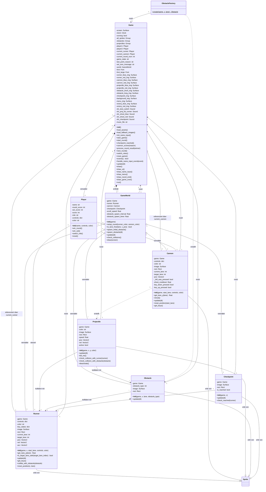

# Run & Boom - UML-Klassendiagramm

```mermaid
classDiagram
    class Game {
        -screen: Surface
        -clock: Clock
        -running: bool
        -all_sprites: Group
        -obstacles: Group
        -projectiles: Group
        -player1: Player
        -player2: Player
        -current_runner: Player
        -current_cannon: Player
        -current_round_num: int
        -game_state: str
        -last_point_reason: str
        -set_won_message: str
        -world: GameWorld
        -font: Font
        -font_large: Font
        -runner_blue_img: Surface
        -runner_red_img: Surface
        -cannon_blue_img: Surface
        -cannon_red_img: Surface
        -projectile_blue_img: Surface
        -projectile_red_img: Surface
        -obstacle_short_img: Surface
        -obstacle_long_img: Surface
        -checkpoint_img: Surface
        -background_img: Surface
        -menu_img: Surface
        -victory_blue_img: Surface
        -victory_red_img: Surface
        -sfx_lane_switch: Sound
        -sfx_proj_hit_runner: Sound
        -sfx_shoot_blue: Sound
        -sfx_shoot_red: Sound
        -sfx_checkpoint: Sound
        -music_file: str
        +__init__()
        +load_assets()
        +load_fallback_images()
        +init_name_input()
        +start_game()
        +start_round()
        +checkpoint_reached()
        +cannon_scores(reason)
        +process_round_result(winner)
        +next_round()
        +switch_roles()
        +reset_game()
        +events() bool
        +handle_name_input_event(event)
        +update(dt)
        +draw()
        +draw_ui()
        +draw_name_input()
        +draw_menu()
        +draw_round_end()
        +draw_game_over()
        +run()
    }

    class GameWorld {
        -game: Game
        -runner: Runner
        -cannon: Cannon
        -checkpoint: Checkpoint
        -scroll_speed: float
        -obstacle_spawn_interval: float
        -obstacle_spawn_timer: float
        +__init__(game)
        +setup_round(runner_color, cannon_color)
        +is_lane_free(lane, x_pos) bool
        +spawn_initial_obstacle()
        +spawn_obstacle(dt)
        +update(dt)
        +check_collisions()
        +draw(screen)
    }

    class Player {
        -name: str
        -round_score: int
        -set_score: int
        -score: int
        -role: str
        -controls: dict
        -color: str
        +__init__(name, controls, color)
        +win_round()
        +win_set()
        +switch_role()
        +reset()
    }

    class Runner {
        -game: Game
        -controls: dict
        -color: str
        -key_states: dict
        -image: Surface
        -rect: Rect
        -current_lane: int
        -target_lane: int
        -pos: Vector2
        -vel: Vector2
        -acc: Vector2
        +__init__(game, x, start_lane, controls, color)
        +get_lane_y(lane) float
        +is_target_lane_safe(target_lane_index) bool
        +update(dt)
        +get_keys()
        +collide_with_obstacle(obstacle)
        +reset_position(x, lane)
    }

    class Cannon {
        -game: Game
        -controls: dict
        -color: str
        -image: Surface
        -rect: Rect
        -current_lane: int
        -target_lane: int
        -pos: Vector2
        -_left_was_pressed: bool
        -shoot_cooldown: float
        -key_down_pressed: bool
        -key_up_pressed: bool
        +__init__(game, start_lane, controls, color)
        +get_lane_y(lane) float
        +shoot()
        +update(dt)
        +reset_position(start_lane)
        +get_keys()
    }

    class Projectile {
        -game: Game
        -color: str
        -image: Surface
        -rect: Rect
        -speed: float
        -pos: Vector2
        -vel: Vector2
        -active: bool
        +__init__(game, x, y, color)
        +update(dt)
        +kill_me()
        +check_collision_with_runner(runner)
        +check_collision_with_obstacle(obstacle)
        +deactivate()
    }

    class Obstacle {
        -game: Game
        -obstacle_type: int
        -image: Surface
        -rect: Rect
        +__init__(game, x, lane, obstacle_type)
        +update(dt)
    }

    class ObstacleFactory {
        +create(game, x, lane)$ Obstacle
    }

    class Checkpoint {
        -game: Game
        -image: Surface
        -rect: Rect
        -is_reached: bool
        +__init__(game, x)
        +update(dt)
        +check_reached(runner)
    }

    %% Beziehungen
    Game "1" *-- "1" GameWorld : enthält
    Game "1" *-- "2" Player : verwaltet
    Game "1" o-- "1" Runner : referenziert über current_runner
    Game "1" o-- "1" Cannon : referenziert über current_cannon
    
    GameWorld "1" o-- "1" Runner : verwaltet
    GameWorld "1" o-- "1" Cannon : verwaltet
    GameWorld "1" o-- "1" Checkpoint : verwaltet
    GameWorld "1" o-- "*" Obstacle : verwaltet
    GameWorld "1" o-- "*" Projectile : verwaltet
    GameWorld "1" --> "1" Game : nutzt
    
    Player "1" -- "1" Runner : steuert
    Player "1" -- "1" Cannon : steuert
    
    Runner --|> Sprite : erbt von
    Runner "1" --> "1" Game : nutzt
    
    Cannon --|> Sprite : erbt von
    Cannon "1" --> "1" Game : nutzt
    Cannon "1" ..> "*" Projectile : erstellt
    
    Projectile --|> Sprite : erbt von
    Projectile "1" --> "1" Game : nutzt
    Projectile "*" --> "1" Runner : kollidiert mit
    Projectile "*" --> "*" Obstacle : kollidiert mit
    
    Obstacle --|> Sprite : erbt von
    Obstacle "1" --> "1" Game : nutzt
    Obstacle "*" --> "1" Runner : kollidiert mit
    
    ObstacleFactory ..> Obstacle : erstellt
    ObstacleFactory "1" --> "1" Game : nutzt
    
    Checkpoint --|> Sprite : erbt von
    Checkpoint "1" --> "1" Game : nutzt
    Checkpoint "1" --> "1" Runner : prüft Kollision
```

